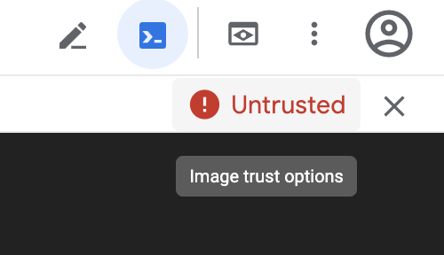
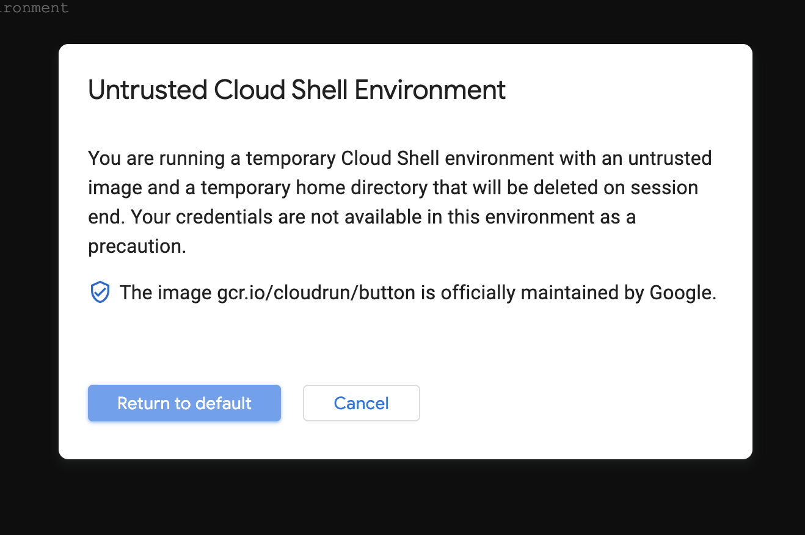
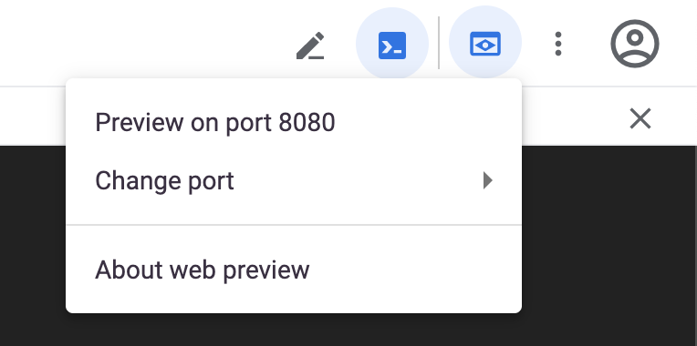

[](https://github.com/moov-io)

<p align="center">
  <a href="https://moov-io.github.io/ach/">Project Documentation</a>
  ·
  <a href="https://moov-io.github.io/ach/api/#get-/files">API Endpoints</a>
  ·
  <a href="https://moov.io/blog/education/ach-api-guide/">API Guide</a>
  ·
  <a href="https://slack.moov.io/">Community</a>
  ·
  <a href="https://moov.io/blog/">Blog</a>
  <br>
  <br>
</p>

[](https://godoc.org/github.com/moov-io/ach)
[](https://github.com/moov-io/ach/actions)
[](https://codecov.io/gh/moov-io/ach)
[](https://goreportcard.com/report/github.com/moov-io/ach)
[](https://github.com/moov-io/ach)
[](https://raw.githubusercontent.com/moov-io/ach/master/LICENSE)
[](https://slack.moov.io/)
[](https://hub.docker.com/r/moov/ach)
[](https://github.com/moov-io/ach)
[](https://twitter.com/moov?lang=en)

# moov-io/ach
Moov's mission is to give developers an easy way to create and integrate bank processing into their own software products. Our open source projects are each focused on solving a single responsibility in financial services and designed around performance, scalability, and ease of use.

ACH implements a reader, writer, and validator for Automated Clearing House ([ACH](https://en.wikipedia.org/wiki/Automated_Clearing_House)) files. ACH is the primary method of electronic money movement throughout the United States. The HTTP server is available in a [Docker image](#docker) and the Go package `github.com/moov-io/ach` is available.

If you're looking for an event driven ACH engine for uploading/downloading files and operations we have built [moov-io/achgateway](https://github.com/moov-io/achgateway) and run it in production. Our article [How and When to use the Moov ACH Library](https://moov.io/blog/education/how-and-when-to-use-the-moov-ach-library/) will help to generate ACH files for upload to your ODFI.

## Table of contents

- [Project status](#project-status)
- [Usage](#usage)
  - As an API
    - [Docker](#docker) ([Config](#configuration-settings))
    - [Google Cloud](#google-cloud-run-button) ([Config](#configuration-settings))
    - [HTTP API](#http-api) ([Config](#configuration-settings))
    - [Data persistence](#data-persistence)
  - [As a Go module](#go-library)
  - [As a command line tool](#command-line)
  - [As an in-browser parser](##in-browser-ach-file-parser)
- [OpenAPI SDKs](#sdks)
- [Learn about ACH](#learn-about-ach)
- [FAQ](#faq)
- [Getting help](#getting-help)
- [Supported and tested platforms](#supported-and-tested-platforms)
- [Contributing](#contributing)
- [Related projects](#related-projects)

## Project status

Moov ACH is actively used in multiple production environments. Please star the project if you are interested in its progress. The project supports generating and parsing all Standard Entry Class (SEC) codes. If you have layers above ACH to simplify tasks, perform business operations, or found bugs we would appreciate an issue or pull request. Thanks!

## Usage

The ACH project implements an HTTP server and Go library for creating and modifying ACH files. There are client libraries available for both [Go](https://pkg.go.dev/github.com/moov-io/ach) and [Node/JavaScript](https://github.com/moov-io/ach-node-sdk). We also have an extensive list of [examples](https://pkg.go.dev/github.com/moov-io/ach/examples) of the reader and writer applied to various ACH transaction types.

### Docker

We publish a [public Docker image `moov/ach`](https://hub.docker.com/r/moov/ach/) from Docker Hub or use this repository. No configuration is required to serve on `:8080` and metrics at `:9090/metrics` in Prometheus format. We also have Docker images for [OpenShift](https://quay.io/repository/moov/ach?tab=tags) published as `quay.io/moov/ach`.

Pull & start the Docker image:
```
docker pull moov/ach:latest
docker run -p 8080:8080 -p 9090:9090 moov/ach:latest
```

List files stored in-memory:
```
curl localhost:8080/files
```
```
{"files":[],"error":null}
```

Create a file on the HTTP server:
```
curl -X POST --data-binary "@./test/testdata/ppd-debit.ach" http://localhost:8080/files/create
```
```
{"id":"<YOUR-UNIQUE-FILE-ID>","error":null}
```

Read the ACH file (in JSON form):
```
curl http://localhost:8080/files/<YOUR-UNIQUE-FILE-ID>
```
```
{"file":{"id":"<YOUR-UNIQUE-FILE-ID>","fileHeader":{"id":"","immediateDestination":"231380104","immediateOrigin":"121042882", ...
```

### Google Cloud Run button

To get started in a hosted environment you can deploy this project to the Google Cloud Platform.

From your [Google Cloud dashboard](https://console.cloud.google.com/home/dashboard) create a new project and call it:
```
moov-ach-demo
```

Click the button below to deploy this project to Google Cloud.

[](https://deploy.cloud.run/?git_repo=https://github.com/moov-io/ach&revision=master)

> **Note**: If you get an error about the image being marked as "Do Not Trust" follow the below steps.

<details>
<summary>Error: You launched this custom Cloud Shell image as "Do not trust"</summary>

```
$ cloudshell_open --repo_url "https://github.com/moov-io/ach" --page "shell" --git_branch "master"
Error: You launched this custom Cloud Shell image as "Do not trust".
In this mode, your credentials are not available and this experience
cannot deploy to Cloud Run. Start over and "Trust" the image.
Error: aborting due to untrusted cloud shell environment
```

This error occurs when some security settings on your account / cloud shell are locked down. To run ACH you need to trust the image, so in the top-right click to restart this image as Trusted.



Click to "Return to default"



Then you'll need to clone down and launch ACH. Pick option #3 to clone this project.

```
cloudshell_open --repo_url "https://github.com/moov-io/ach" --page "shell" --git_branch "master"
```

Start the ACH server inside the cloned repository.
```
go run ./cmd/serverr
```

Connect to the web preview (e.g. `https://YOUR-ACH-APP-URL.a.run.app:8080/files`)


<hr /> <!-- end the details section -->

</details>


In the cloud shell you should be prompted with:
```
Choose a project to deploy this application:
```

Using the arrow keys select:
```
moov-ach-demo
```


You'll then be prompted to choose a region, use the arrow keys to select the region closest to you and hit enter.
```
Choose a region to deploy this application:
```


Upon a successful build you will be given a URL where the API has been deployed:
```
https://YOUR-ACH-APP-URL.a.run.app
```

From the cloud shell you need to cd into the `ach` folder:
```
cd ach
```

Now you can list files stored in-memory:
```
curl https://YOUR-ACH-APP-URL.a.run.app/files
```
You should get this response:
```
{"files":[],"error":null}
```


Create a file on the server:
```
curl -X POST --data-binary "@./test/testdata/ppd-debit.ach" https://YOUR-ACH-APP-URL.a.run.app/files/create
```
You should get this response:
```
{"id":"<YOUR-UNIQUE-FILE-ID>","error":null}
```


Finally, read the contents of the file you've just posted:
```
curl https://YOUR-ACH-APP-URL.a.run.app/files/<YOUR-UNIQUE-FILE-ID>
```

You should get this response:
```
{"file":{"id":"<YOUR-UNIQUE-FILE-ID>","fileHeader":{"id":"...","immediateDestination":"231380104","immediateOrigin":"121042882", ...
```

### HTTP API

The package [`github.com/moov-io/ach/server`](https://pkg.go.dev/github.com/moov-io/ach/server) offers an HTTP and JSON API for creating and editing files. If you're using Go the `ach.File` type can be used, otherwise you can send properly formatted JSON. We have an [example JSON file](test/testdata/ppd-valid.json), but each SEC type will generate different JSON.

Examples: [Go](examples/http/main.go) | [Ruby](https://github.com/moov-io/ruby-ach-demo)

- [Create an ACH file for a payment and get the raw file](https://github.com/moov-io/ruby-ach-demo)


### Configuration settings

| Environmental Variable | Description | Default |
|-----|-----|-----|
| `ACH_FILE_TTL` | Time to live (TTL) for `*ach.File` objects stored in the in-memory repository. | 0 = No TTL / Never delete files (Example: `240m`) |
| `LOG_FORMAT` | Format for logging lines to be written as. | Options: `json`, `plain` - Default: `plain` |
| `HTTP_BIND_ADDRESS` | Address for ACH to bind its HTTP server on. This overrides the command-line flag `-http.addr`. | Default: `:8080` |
| `HTTP_ADMIN_BIND_ADDRESS` | Address for ACH to bind its admin HTTP server on. This overrides the command-line flag `-admin.addr`. | Default: `:9090` |
| `HTTPS_CERT_FILE` | Filepath containing a certificate (or intermediate chain) to be served by the HTTP server. Requires all traffic be over secure HTTP. | Empty |
| `HTTPS_KEY_FILE`  | Filepath of a private key matching the leaf certificate from `HTTPS_CERT_FILE`. | Empty |

### Data persistence
By design ACH **does not persist** (save) any data about the files, batches, or entry details created. The only storage occurs in memory of the process and upon restart ACH will have no files, batches, or data saved. Also, no in memory encryption of the data is performed.


### Go library

This project uses [Go Modules](https://github.com/golang/go/wiki/Modules) and Go v1.14 or higher. See [Golang's install instructions](https://golang.org/doc/install) for help in setting up Go. You can download the source code and we offer [tagged and released versions](https://github.com/moov-io/ach/releases/latest) as well. We highly recommend you use a tagged release for production.

```
# Pull down into the Go Module cache
$ go get -u github.com/moov-io/ach

# Show the documentation for the BatchHeader package
$ go doc github.com/moov-io/ach BatchHeader
```

The package [`github.com/moov-io/ach`](https://pkg.go.dev/github.com/moov-io/ach) offers a Go-based ACH file reader and writer. To get started, check out a specific example:

<details>
<summary>Supported Standard Entry Class (SEC) codes</summary>

| SEC Code | Description                                  | Example                                  | Read                | Write                                            |
|----------|---------------------------------------|------------------------------------------|-----------------------------------|------------------------------------|
| ACK      | Acknowledgment Entry for CCD          | [Credit](examples/testdata/ack-read.ach) | [ACK Read](https://pkg.go.dev/github.com/moov-io/ach/examples#example-package-AckRead) | [ACK Write](https://pkg.go.dev/github.com/moov-io/ach/examples#example-package-AckWrite) |
| ADV      | Automated Accounting Advice           | [Prenote Debit](test/ach-adv-read/adv-read.ach) | [ADV Read](https://pkg.go.dev/github.com/moov-io/ach/examples#example-package-AdvRead) | [ADV Write](https://pkg.go.dev/github.com/moov-io/ach/examples#example-package-AdvWrite) |
| ARC      | Accounts Receivable Entry             | [Debit](test/ach-arc-read/arc-debit.ach) | [ARC Read](https://pkg.go.dev/github.com/moov-io/ach/examples#example-package-ArcReadDebit) | [ARC Write](https://pkg.go.dev/github.com/moov-io/ach/examples#example-package-ArcWriteDebit) |
| ATX      | Acknowledgment Entry for CTX          | [Credit](test/ach-atx-read/atx-read.ach)  | [ATX Read](https://pkg.go.dev/github.com/moov-io/ach/examples#example-package-AtxRead) | [ATX Write](https://pkg.go.dev/github.com/moov-io/ach/examples#example-package-AtxWrite) |
| BOC      | Back Office Conversion                | [Debit](test/ach-boc-read/boc-debit.ach) | [BOC Read](https://pkg.go.dev/github.com/moov-io/ach/examples#example-package-BocReadDebit) | [BOC Write](https://pkg.go.dev/github.com/moov-io/ach/examples#example-package-BocWriteDebit) |
| CCD      | Corporate credit or debit             | [Debit](test/ach-ccd-read/ccd-debit.ach) | [CCD Read](https://pkg.go.dev/github.com/moov-io/ach/examples#example-package-CcdReadDebit) | [CCD Write](https://pkg.go.dev/github.com/moov-io/ach/examples#example-package-CcdWriteDebit) |
| CIE      | Customer-Initiated Entry              | [Credit](test/ach-cie-read/cie-credit.ach) | [CIE Read](https://pkg.go.dev/github.com/moov-io/ach/examples#example-package-CieRead) | [CIE Write](https://pkg.go.dev/github.com/moov-io/ach/examples#example-package-CieWrite) |
| COR      | Automated Notification of Change(NOC) | [NOC](test/ach-cor-read/cor-read.ach)   | [COR Read](https://pkg.go.dev/github.com/moov-io/ach/examples#example-package-CorReadCredit) | [COR Write](https://pkg.go.dev/github.com/moov-io/ach/examples#example-package-CorWriteCredit) |
| CTX      | Corporate Trade Exchange              | [Debit](test/ach-ctx-read/ctx-debit.ach) | [CTX Read](https://pkg.go.dev/github.com/moov-io/ach/examples#example-package-CtxReadDebit) | [CTX Write](https://pkg.go.dev/github.com/moov-io/ach/examples#example-package-CtxWriteDebit) |
| DNE      | Death Notification Entry              | [DNE](test/ach-dne-read/dne-read.ach)   | [DNE Read](https://pkg.go.dev/github.com/moov-io/ach/examples#example-package-DneRead) | [DNE Write](https://pkg.go.dev/github.com/moov-io/ach/examples#example-package-DneWrite) |
| ENR      | Automatic Enrollment Entry            | [ENR](test/ach-enr-read/enr-read.ach)   | [ENR Read](https://pkg.go.dev/github.com/moov-io/ach/examples#example-package-EnrRead) | [ENR Write](https://pkg.go.dev/github.com/moov-io/ach/examples#example-package-EnrWrite) |
| IAT      | International ACH Transactions        | [Credit](test/ach-iat-read/iat-credit.ach) | [IAT Read](https://pkg.go.dev/github.com/moov-io/ach/examples#example-package-IatReadMixedCreditDebit) | [IAT Write](https://pkg.go.dev/github.com/moov-io/ach/examples#example-package-IatWriteMixedCreditDebit) |
| MTE      | Machine Transfer Entry                | [Credit](test/ach-mte-read/mte-read.ach)   | [MTE Read](https://pkg.go.dev/github.com/moov-io/ach/examples#example-package-MteReadDebit) | [MTE Write](https://pkg.go.dev/github.com/moov-io/ach/examples#example-package-MteWriteDebit) |
| POP      | Point of Purchase                     | [Debit](test/ach-pop-read/pop-debit.ach) | [POP Read](https://pkg.go.dev/github.com/moov-io/ach/examples#example-package-PopReadDebit) | [POP Write](https://pkg.go.dev/github.com/moov-io/ach/examples#example-package-PopWriteDebit) |
| POS      | Point of Sale                         | [Debit](test/ach-pos-read/pos-debit.ach) | [POS Read](https://pkg.go.dev/github.com/moov-io/ach/examples#example-package-PosReadDebit) | [POS Write](https://pkg.go.dev/github.com/moov-io/ach/examples#example-package-PosWriteDebit) |
| PPD      | Prearranged payment and deposits      | [Debit](test/ach-ppd-read/ppd-debit.ach) [Credit](test/ach-ppd-read/ppd-credit.ach) | [PPD Read](https://pkg.go.dev/github.com/moov-io/ach/examples#example-package-PpdReadCredit) | [PPD Write](https://pkg.go.dev/github.com/moov-io/ach/examples#example-package-PpdWriteCredit) |
| RCK      | Represented Check Entries             | [Debit](test/ach-rck-read/rck-debit.ach) | [RCK Read](https://pkg.go.dev/github.com/moov-io/ach/examples#example-package-RckReadDebit) | [RCK Write](https://pkg.go.dev/github.com/moov-io/ach/examples#example-package-RckWriteDebit) |
| SHR      | Shared Network Entry                  | [Debit](test/ach-shr-read/shr-debit.ach) | [SHR Read](https://pkg.go.dev/github.com/moov-io/ach/examples#example-package-ShrReadDebit) | [SHR Write](https://pkg.go.dev/github.com/moov-io/ach/examples#example-package-ShrWrite) |
| TEL      | Telephone-Initiated Entry             | [Debit](test/ach-tel-read/tel-debit.ach) | [TEL Read](https://pkg.go.dev/github.com/moov-io/ach/examples#example-package-TelReadDebit) | [TEL Write](https://pkg.go.dev/github.com/moov-io/ach/examples#example-package-TelWriteDebit) |
| TRC      | Truncated Check Entry                 | [Debit](test/ach-trc-read/trc-debit.ach) | [TRC Read](https://pkg.go.dev/github.com/moov-io/ach/examples#example-package-TrcReadDebit) | [TRC Write](https://pkg.go.dev/github.com/moov-io/ach/examples#example-package-TrcWriteDebit) |
| TRX      | Check Truncation Entries Exchange     | [Debit](test/ach-trx-read/trx-debit.ach) | [TRX Read](https://pkg.go.dev/github.com/moov-io/ach/examples#example-package-TrxReadDebit) | [TRX Write](https://pkg.go.dev/github.com/moov-io/ach/examples#example-package-TrxWriteDebit) |
| WEB      | Internet-initiated Entries            | [Credit](test/ach-web-read/web-credit.ach) | [WEB Read](https://pkg.go.dev/github.com/moov-io/ach/examples#example-package-WebReadCredit) | [WEB Write](https://pkg.go.dev/github.com/moov-io/ach/examples#example-package-WebWriteCredit) |
| XCK      | Destroyed Check Entry                 | [Debit](test/ach-xck-read/xck-debit.ach)  | [XCK Read](https://pkg.go.dev/github.com/moov-io/ach/examples#example-package-XckReadDebit) | [XCK Write](https://pkg.go.dev/github.com/moov-io/ach/examples#example-package-XckWriteDebit) |

</details>

<details>
<summary>Segment Files</summary>

| SEC Code | Name                                  | Example                                  | Read                | Write                                            |
|----------|---------------------------------------|------------------------------------------|-----------------------------------|------------------------------------|
| IAT      | International ACH Transactions        | [Credit](test/ach-iat-read/iat-credit.ach) | [IAT Read](https://pkg.go.dev/github.com/moov-io/ach/examples#example-package-IatReadMixedCreditDebit) | [IAT Write](https://pkg.go.dev/github.com/moov-io/ach/examples#example-package-IatWriteMixedCreditDebit) |
| PPD      | Prearranged payment and deposits      | [Debit](test/ach-ppd-read/ppd-debit.ach) [Credit](test/ach-ppd-read/ppd-credit.ach) | [PPD Read](https://pkg.go.dev/github.com/moov-io/ach/examples#example-package-PpdReadSegmentFile) | [PPD Write](https://pkg.go.dev/github.com/moov-io/ach/examples#example-package-PpdWriteSegmentFile) |

</details>

### Command line

On each release there's an `achcli` utility released. This tool can display ACH files in a human-readable format which is easier to read than their plaintext format. It also allows masking `DFIAccountNumber` values with the `-mask` flag.

```
$ wget -O ./achcli https://github.com/moov-io/ach/releases/download/v1.6.3/achcli-darwin-amd64 && chmod +x ./achcli

$ achcli test/testdata/ppd-debit.ach
Describing ACH file 'test/testdata/ppd-debit.ach'

  Origin     OriginName    Destination  DestinationName       FileCreationDate  FileCreationTime
  121042882  My Bank Name  231380104    Federal Reserve Bank  190624            0000

  BatchNumber  SECCode  ServiceClassCode  CompanyName      DiscretionaryData  Identification  EntryDescription  DescriptiveDate
  1            PPD      225 (Debits Only)  Name on Account                     121042882       REG.SALARY

    TransactionCode   RDFIIdentification  AccountNumber      Amount     Name                    TraceNumber      Category
    27 (Checking Debit)  23138010            12345678           100000000  Receiver Account Name   121042880000001

  ServiceClassCode  EntryAddendaCount  EntryHash  TotalDebits  TotalCredits  MACCode  ODFIIdentification  BatchNumber
  225 (Debits Only)  1                  23138010   100000000    0                      12104288            1

  BatchCount  BlockCount  EntryAddendaCount  TotalDebitAmount  TotalCreditAmount
  1           1           1                  100000000         0
```

### In-browser ACH file parser
Using our [in-browser utility](http://oss.moov.io/ach/), you can instantly convert ACH files into JSON. Either paste in ACH file content directly or choose a file from your local machine. This tool is particularly useful if you're handling sensitive PII or want perform some quick tests, as operations are fully client-side with nothing stored in memory.

### SDKs

Below are some SDKs generated from the API documentation:

- [Node SDK](https://www.npmjs.com/package/ach-node-sdk) | [GitHub](https://github.com/moov-io/ach-node-sdk)

- TODO - OpenAPI Guide

## Learn about ACH

- [Official Nacha ACH Guide for Developers](https://dev-ach-guide.pantheonsite.io/)
- [Intro to ACH](https://moov-io.github.io/ach/intro/)
- [Create an ACH File](https://moov-io.github.io/ach/create-file/)
- [ACH File Structure](https://moov-io.github.io/ach/file-structure/)
- [Balanced Offset Files](https://moov-io.github.io/ach/balanced-offset/)
- [Merging Files](https://moov-io.github.io/ach/merging-files/)

## FAQ
<details open="true">
<summary ><b>Is there an in-browser tool for converting ACH files into JSON?</b></summary>
Yes! You can find our browser utility at <a href="http://oss.moov.io/ach/">http://oss.moov.io/ach/</a>.
</details>
<details open="true">
<summary><b>Is my data being saved somewhere?</b></summary>
No, we do not save any data related to files, batch, or entry details. All processing is done in-memory.
</details>
<details open="true">
<summary><b>What ACH transaction types are supported?</b></summary>
We support generating and parsing all Standard Entry Class (SEC) codes.
</details>
<details open="true">
<summary><b>Where can I find the official Nacha Operating Rules?</b></summary>
You can purchase the most recent Nacha Operating Rules and Guidelines resource directly from their <a href="https://www.nacha.org/store">webstore</a>. Additionally, Nacha has published a <a href="https://dev-ach-guide.pantheonsite.io/">free ACH guide for developers</a>.
</details>

## Getting help

If you have ACH-specific questions, NACHA (National Automated Clearing House Association) has their [complete specification](docs/2013-Corporate-Rules-and-Guidelines.pdf) for all file formats and message types.

 channel | info
 ------- | -------
 [Project Documentation](https://moov-io.github.io/ach/) | Our project documentation available online.
Twitter [@moov](https://twitter.com/moov)	| You can follow Moov.io's Twitter feed to get updates on our project(s). You can also tweet us questions or just share blogs or stories.
[GitHub Issue](https://github.com/moov-io/ach/issues/new) | If you are able to reproduce a problem please open a GitHub Issue under the specific project that caused the error.
[moov-io slack](https://slack.moov.io/) | Join our slack channel to have an interactive discussion about the development of the project.

## Supported and tested platforms

- 64-bit Linux (Ubuntu, Debian), macOS, and Windows
- Raspberry Pi

Note: 32-bit platforms have known issues and are not supported.

## Contributing

Yes please! Please review our [Contributing guide](CONTRIBUTING.md) and [Code of Conduct](CODE_OF_CONDUCT.md) to get started! Check out our [issues for first time contributors](https://github.com/moov-io/ach/contribute) for something to help out with.

This project uses [Go Modules](https://github.com/golang/go/wiki/Modules) and uses Go v1.14 or higher. See [Golang's install instructions](https://golang.org/doc/install) for help setting up Go. You can download the source code and we offer [tagged and released versions](https://github.com/moov-io/ach/releases/latest) as well. We highly recommend you use a tagged release for production.

### Releasing

To make a release of ach simply open a pull request with `CHANGELOG.md` and `version.go` updated with the next version number and details. You'll also need to push the tag (i.e. `git push origin v1.0.0`) to origin in order for CI to make the release.

### Testing

We maintain a comprehensive suite of unit tests and recommend table-driven testing when a particular function warrants several very similar test cases. To run all test files in the current directory, use `go test`. Current overall coverage can be found on [Codecov](https://app.codecov.io/gh/moov-io/ach/).

### Fuzzing

We currently run fuzzing over ACH in the form of a [`moov/achfuzz`](https://hub.docker.com/r/moov/achfuzz) Docker image. You can [read more](./test/fuzz-reader/README.md) or run the image and report crasher examples to [`security@moov.io`](mailto:security@moov.io). Thanks!


## Related projects
As part of Moov's initiative to offer open source fintech infrastructure, we have a large collection of active projects you may find useful:

- [Moov Watchman](https://github.com/moov-io/watchman) offers search functions over numerous trade sanction lists from the United States and European Union.

- [Moov Fed](https://github.com/moov-io/fed) implements utility services for searching the United States Federal Reserve System such as ABA routing numbers, financial institution name lookup, and FedACH and Fedwire routing information.

- [Moov Wire](https://github.com/moov-io/wire) implements an interface to write files for the Fedwire Funds Service, a real-time gross settlement funds transfer system operated by the United States Federal Reserve Banks.

- [Moov Image Cash Letter](https://github.com/moov-io/imagecashletter) implements Image Cash Letter (ICL) files used for Check21, X.9 or check truncation files for exchange and remote deposit in the U.S.

- [Moov Metro 2](https://github.com/moov-io/metro2) provides a way to easily read, create, and validate Metro 2 format, which is used for consumer credit history reporting by the United States credit bureaus.


## License

Apache License 2.0 - See [LICENSE](LICENSE) for details.
